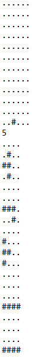
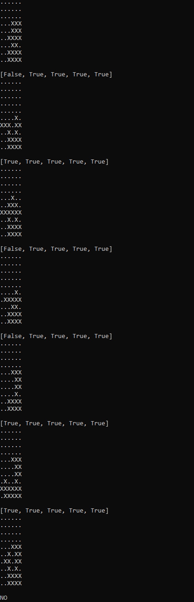

# Tetrisito

## About the Project
Tetrisito is a custom variant of the puzzle game Tetris. The game involves a 6x6 square grid of cells as its space and four-block pieces that fit on a smaller 4x4 grid. The following are the information provided beofre playing the game:
1. An initial 6x6 grid, *which may or may not be empty*.
2. A goal 6x6 grid which signifies a configuration of the grid after an arbitrary number of pieces has been "dropped" into it
3. One to five pieces which can be ”dropped” into the working grid.
   
Tetrisito is simpler than Tetris as the pieces can only be moved horizontally at the start (i.e. before "dropping" them) and may not be rotated. The goal of the puzzle is to figure out if we can achieve the goal grid given the initial grid and using the pieces provided, which is what the program is trying to achieve.

As such, two outputs are possible:
1. `YES` - This means that the goal configuration can be achieved using the initial space and pieces provided.
2. `NO` - This means that the goal configuration *cannot* be achieved using the initial space and pieces provided.

## Getting Started

### Input Format
The program takes in multiple lines of input which are listed in order as follows:
1. The initial 6x6 grid
  - The grid contains 6 rows, each separated by a newline.
  - Each row contains 6 ASCII characters
  - Each character may either be a period `.` indicating a blank space or a pound `#` indicating an occupied space.
2. The goal 6x6 grid
  - Its format should exactly be the same as that of the initial grid.
3. The number of pieces `n`
  -  `n` should be a number from `1` to `5`
4. The `n` 4x4 pieces themselves
  - The grid contains 4 rows, each separated by a newline.
  - Each row contains 4 ASCII characters
  - Each character may either be a period `.` indicating a blank space or a pound `#` indicating an occupied space.

Please see the section below for a sample of the correct format.

### Sample Input and Output (Snippet)

  

  

### Running the Program
To run the program, do the following:
1. Navigate to the project's root directory.
2. Run the command `java -jar Mars4_5.jar p nc sm main.asm`.
3. Provide the initial 6x6 grid, goal 6x6 grid, the number of pieces, and the pieces themselves.

Alternatively, it may be more convenient to provide the input as a text file. In that case, do the following instead:
1. Navigate to the project's root directory.
2. Place the `.in` text file inside the `./test` folder.
3. Run the command `java -jar Mars4_5.jar p nc sm main.asm < YOURINPUTFILE.in`.
   
For sample test cases and their corresponding outputs, please refer to the `test` folder.

## Contributors
* Rohan Solas
